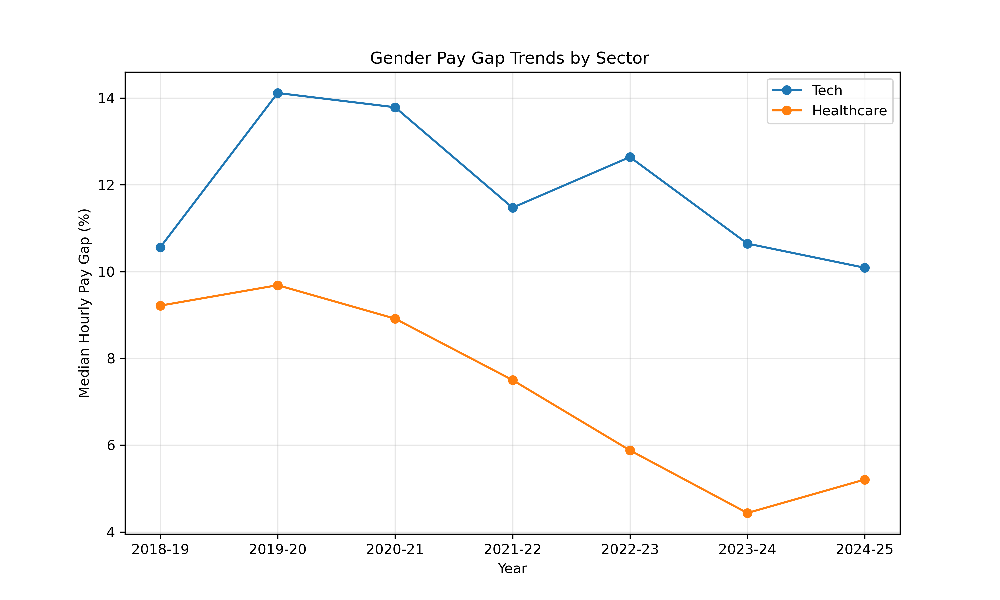
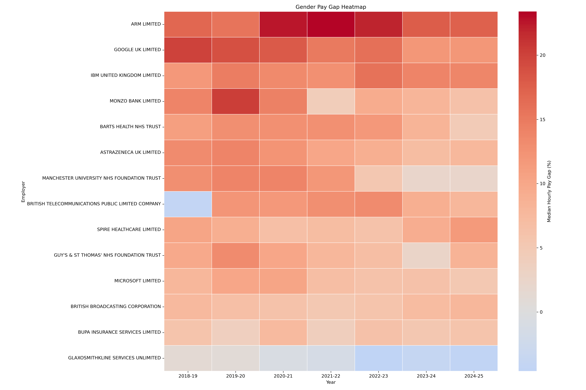
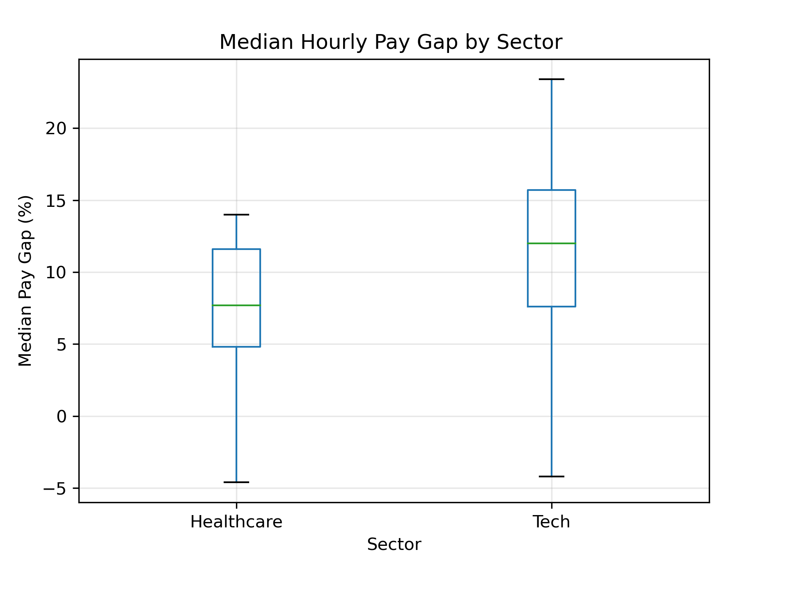

UK Gender Pay Gap Analysis

This project explores the gender pay gap in the UK for a selected group of employers from the Tech and Healthcare sectors.
The goal was to load the data, clean it, join yearly files into one dataset, add a sector column and create simple visual analysis to compare the two industries.

All datasets come from the official UK Government Gender Pay Gap service:

https://gender-pay-gap.service.gov.uk/compare-employers/2024

On this website you can:

• choose any reporting year

• select specific companies

• download CSV files with full employer reports

This project uses seven reporting years:

• 2018–19

• 2019–20

• 2020–21

• 2021–22

• 2022–23

• 2023–24

• 2024–25

Raw files are stored in:

    data/raw/

The combined and cleaned dataset is stored in:

    data/processed/combined_with_sector.csv

   What I Did in This Project

- Data Preparation

1. Loads all yearly CSV files

2. Combines them into one dataframe

3. Cleans employer names

4. Adds a Sector column (Tech or Healthcare)

5. Saves a final processed CSV file

- Analysis & Visualisations

1. Shows gender pay gap trends over time

2. Builds a heatmap for all employers

3. Compares sectors using a boxplot

4. Identifies the best and worst employers

5. Runs a statistical test (t-test)

6. Saves all charts automatically

Visualisations
1. Gender Pay Gap Trends (2018–2025) 

Explanation:
This line chart shows how the median hourly pay gap changes over time.
Tech companies keep higher gap values every year.
Healthcare shows a clear decrease after 2021.

2. Employer Heatmap

 

Explanation:
Each row is an employer, each column is a reporting year.
Red colours = higher gaps.
We can see companies like ARM and Google stay high across all years.
Some Healthcare organisations stay low or even near zero.

3. Sector Boxplot

Explanation:
This chart compares the distribution of pay gaps between sectors.
Tech has higher values and more variation.
Healthcare is lower and more stable.

   Statistical Test (t-test)

A Welch two-sample t-test was used to check if the difference between sectors is real.

Result:

    t = 4.33

    p < 0.001

Meaning:
The difference is statistically significant.
Tech has a higher gender pay gap than Healthcare, and this is not random.

   Key Findings

Tech sector consistently reports higher gender pay gaps

Healthcare shows improvement, especially after 2021

Some Tech companies show very high gaps across all years

Some Healthcare employers report low or even negative gaps

Statistical testing confirms the sectors are meaningfully different

   Short Conclusion

The gender pay gap remains noticeably higher in the Tech sector than in Healthcare.
Healthcare shows strong positive trends, while the Tech sector shows slow or limited improvement.
The difference is strong enough to be statistically confirmed.

???  How to Use This Script (full_analysis.py)

You can use this tool with your own CSV files.
The code is designed so that you only need to change two lines.

1. Place your CSV files in the folder:
    data/raw/

Your files must be yearly gender pay gap CSVs downloaded from the official website.

2. (Optional) Update company lists

At the top of the script you will see:

    TECH_COMPANIES = [ ... ]
    HEALTHCARE_COMPANIES = [ ... ]

You can replace these lists with your own companies.
Names must match exactly how they appear in your CSV files.

3. Run the script

In your terminal:

    python3 full_analysis.py

Before running, the script will ask:

Are you sure you are using the correct raw data files? (y/n):

Press y to continue.

4. Outputs

After running, the script creates:

• A cleaned combined CSV
• Updated CSVs for best/worst employers
• Three visualisations:

    plot_trends_v2.png
    plot_heatmap_v2.png
    plot_boxplot_v2.png

All results are saved into:

    data/processed/

