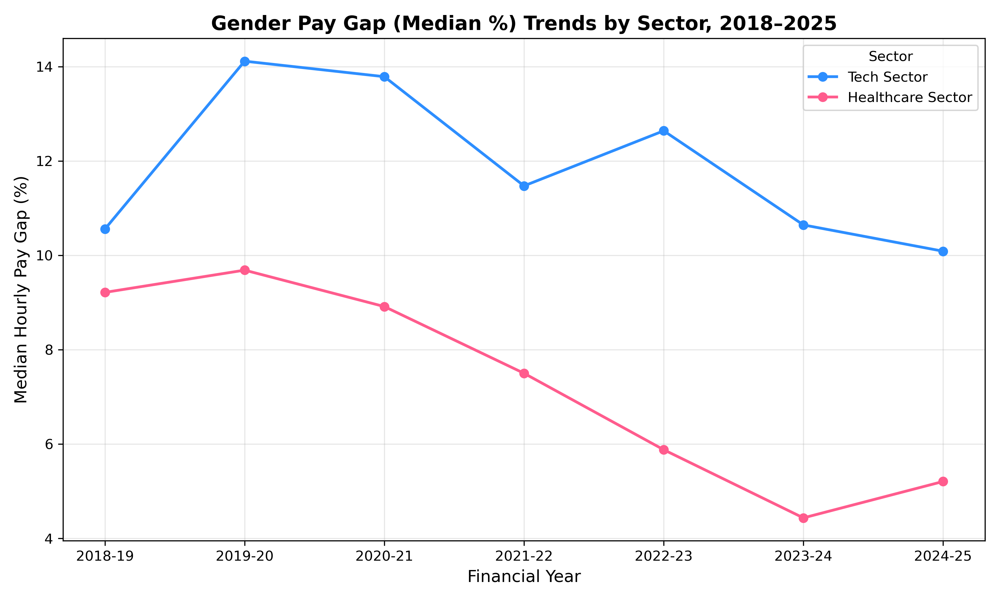
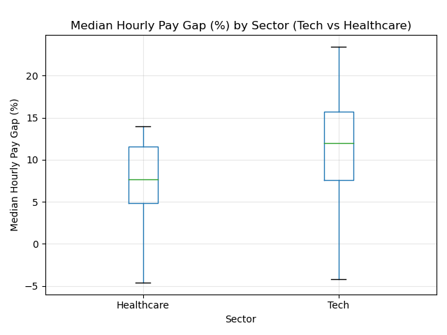

UK Gender Pay Gap Analysis

This project explores the gender pay gap in the UK for a selected group of employers from the Tech and Healthcare sectors.
The goal was to load the data, clean it, join yearly files into one dataset, add a sector column and create simple visual analysis to compare the two industries.

Data Sources

The datasets come from the UK Government Gender Pay Gap Service.
The original CSV files were downloaded for seven reporting years:

2018 to 2019

2019 to 2020

2020 to 2021

2021 to 2022

2022 to 2023

2023 to 2024

2024 to 2025

Each file contains official pay gap reports submitted by employers.
From these files, only selected Tech companies and Healthcare organisations were used.
All raw files are stored in data/raw/.
A combined and cleaned dataset is stored in:
data/processed/combined_with_sector.csv

What I Did in This Project

Loaded all yearly datasets.

Cleaned the columns and combined them into one table.

Added a new column Sector (Tech or Healthcare).

Built visualisations to show trends and compare both sectors.

Found the best and worst employers (lowest and highest gender pay gaps).

Ran a statistical test to check if the difference between the sectors is real.

Visual Analysis

Below are short explanations for each visual.

1. Trends Over Time

This line chart shows how the median hourly gender pay gap changed from 2018 to 2025.
The Tech sector keeps a higher pay gap across all years. Healthcare shows a clear decrease over time.

2. Heatmap of Employers

Each row is one employer and each column is a year.
Darker red means a bigger pay gap.
We can see that Tech companies like ARM and Google have consistently stronger gaps.
Healthcare employers are more stable and often show lower values.

3. Boxplot by Sector

The boxplot makes the difference between sectors clear.
The Tech sector has higher median values and a wider spread.
Healthcare has lower gaps and less variation.

Statistical Test

I used a two-sample t-test (Welch version) to check if Tech and Healthcare are truly different.
Result:

t = 4.33

p < 0.001

This means the difference is statistically significant.
In simple words, Tech really has a higher gender pay gap than Healthcare and this is not random.

Main Findings

The Tech sector shows consistently higher pay gaps every year.

Healthcare shows improvement over time, especially after 2021.

Some Tech employers repeatedly appear at the top of the list with large gaps.

Some Healthcare organisations even report slightly negative gaps.

The statistical test confirms that the difference between Tech and Healthcare is real.

Short Conclusion

The gender pay gap in the UK remains higher in the Tech sector than in Healthcare.
This pattern is visible in the visuals and confirmed by statistical testing.
Healthcare employers show more positive progress, while the Tech sector still has persistent gaps that do not fully improve across the years.